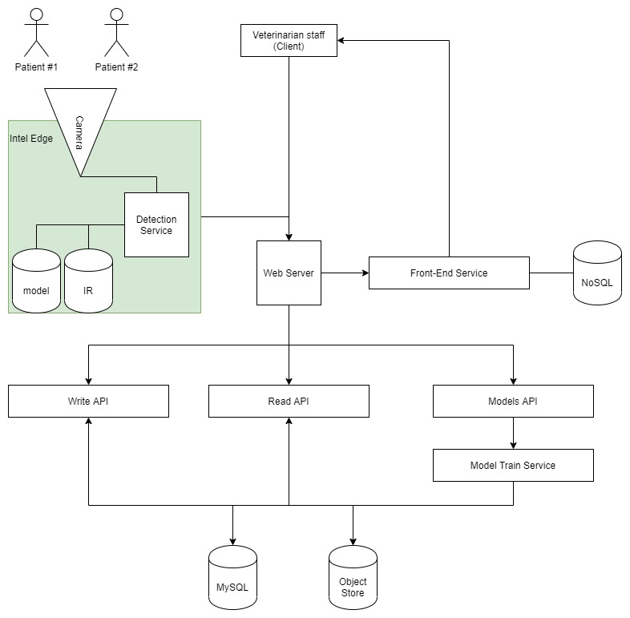

# animal-detection-service

## Project Overview
Provide animal detection services for veterinarians to assist animal well-being in the waiting rooms, recording animal patient growth, and more. 

## Implemented
### Intel Edge Animal Video Detection
Let's say you have a cat and two dogs at your house. If both dogs are in a room together, they are best buds, and everything is going well. If the cat and dog #1 are in a room together, they are also good friends, and everything is fine. However, if the cat and dog #2 are in a room together, they don't get along, and you may need to either pull them apart, or at least play a pre-recorded message from your smart speaker to tell them to cut it out.

In this application, we receive a video where some combination or the cat and dogs may be in view. We also have an IR that is able to determine which of these, if any, are on screen.

While the best model for this is likely an object detection model that can identify different breeds, we have a very basic (and overfit) model that return three classes, one for one or less pets on screen, one for the bad combination of the cat and dog #2, and one for the fine combination of the cat and dog #1. This is within the exercise directory - model.xml.

This application prints to the terminal anytime the bad combination of the cat and dog #2 are detected together.

### Dog Breed Classifer
For this image classification task we used an image classification application using a deep learning model called a convolutional neural network (CNNs). CNNs work particularly well for detecting features in images like colors, textures, and edges; then using these features to identify objects in the images. We used a CNN that has already learned the features from a giant dataset of 1.2 million images called ImageNet. There are different types of CNNs that have different structures (architectures) that work better or worse depending on your criteria. With this project you'll explore the three different architectures (AlexNet, VGG, and ResNet) and determine which is best for your application.

Certain breeds of dog look very similar. The more images of two similar looking dog breeds that the algorithm has learned from, the more likely the algorithm will be able to distinguish between those two breeds. We have found the following breeds to look very similar: Great Pyrenees and Kuvasz, German Shepherd and Malinois, Beagle and Walker Hound, amongst others.

## Future Development

### (1). Intel Edge Animal Video Detection With Dog Breed Classifer
Add dog breed classifier functionalities when examining the video stream.

### (2). Add Real-Time Video Streaming Functionality
Add real-time video stream functionality.

### (3). Custom Trained Models
Build custom train models to examine growth of animals over time.

### (4). Store Values To Database
Add MySQL server and Object Store.

### (5). Develop Front-End capabilities
Add Vue.js implementation for displaying alerts and other information to veterinarian staff.

### High Overview System Design

Below are further information on each services.
- Detection Service: process running on intel edge openvino, detecting animals via video stream and sending information to webserver

- Web Server: handling inputs from intel edge openvino device and veterinarian staff

- Front-End Service: generates front-end html using vue.js and sends information back to client

- Write API: processes all write api commands to store in mysql and object store

- Read API: handle read api requests from client

- Models API: trains future models to generate animal detection models

### Constraints
Below are possible constraints that we may face during development. More information for each contraint will be provided.
- Bandwidth

- Memory Size and Storage

- Process Time

- Developing custom models

- Video stream quality